# Week 5: SoC Verification Waveforms & Analysis

This document provides visual waveform logs and timing analysis for standalone management SoC tests and Caravel chip-level simulations.

---

## 1. Standalone SoC Simulations

### 01. Standalone GPIO Management
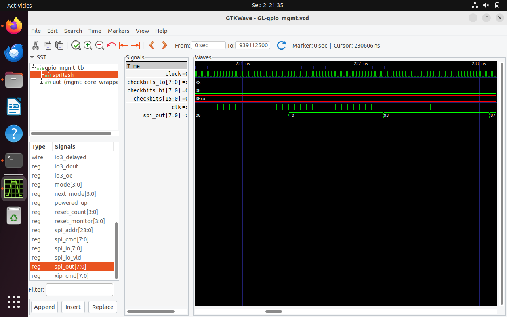
*Monitors clock synchronization, test status updates on checkbits[15:0], and serial flash byte transitions on spi_out[7:0] during gate-level standalone GPIO management execution.*

---

### 02. Standalone Memory

*Verifies standalone SRAM read/write integrity by observing reset de-assertion (RSTB), stable system clock, and sequential test-pass milestone flags on checkbits[15:0] (A040, A020, A010, A050).*

---

### 03. Standalone UART

*Confirms gate-level UART transmitter timing and frame serialization via active pulses on uart_tx and test completion flags on checkbits[15:0]*

---

### 04. Standalone SPI Master
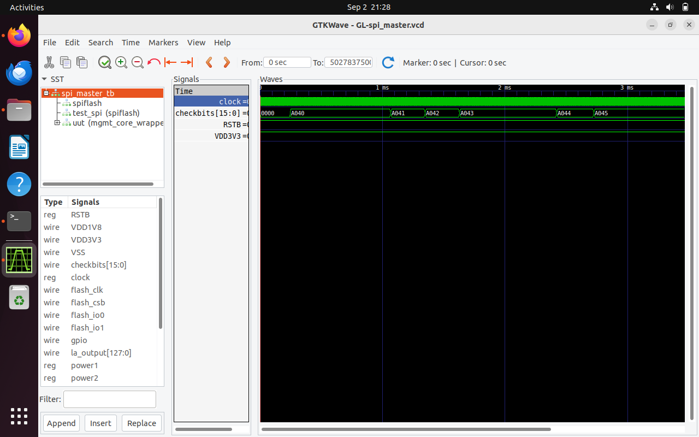
*Verifies serial clock generation (SCK), chip-select asserts (CSB), and serial byte shifts on MOSI/MISO lines.*

---

## 2. Caravel Chip-Level Simulations

### 05. Caravel User Pass-Thru
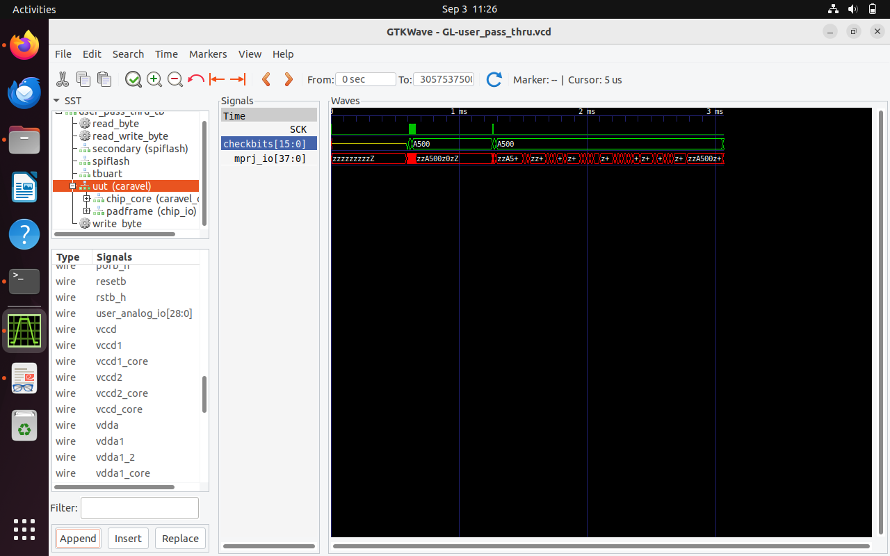
*Monitors the housekeeping SPI switching into direct pass-through mode to fetch instructions from external SPI flash.*

---

### 06. Caravel GPIO Management
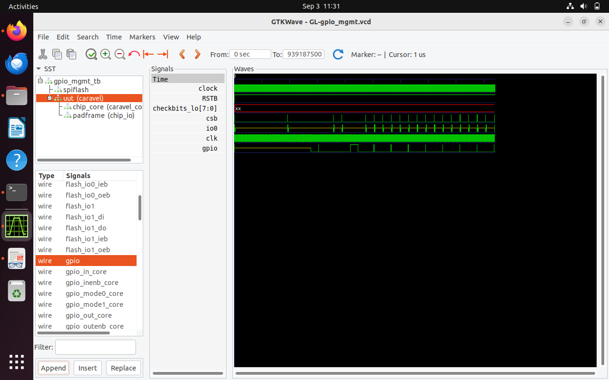
*Checks the Caravel management processor driving the chip-level GPIO pads through programmed blink sequences.*

---

### 07. Caravel UART
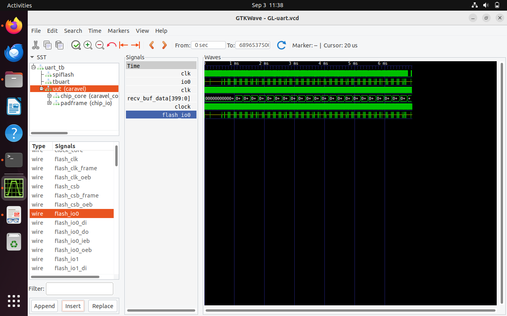
*Confirms full-system serial communication by monitoring TX/RX pin activity through the Caravel I/O pad ring.*

---

### 08. Caravel Memory
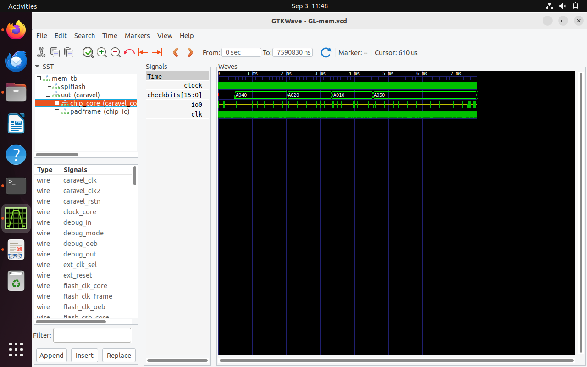
*Examines system-level memory interface timing, verifying byte enables and word-level data transfers inside the harness.*

---

### 09. Caravel SPI Master
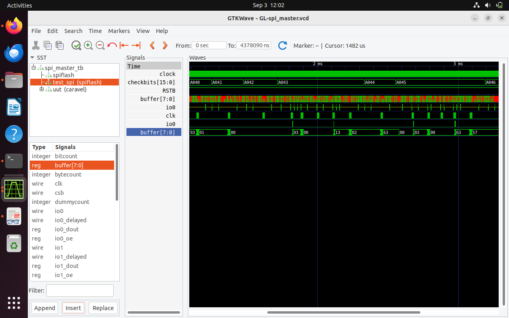
*Validates the SPI master controller communicating with external peripherals routed through the chip boundary pins.*

---

### 10. Caravel SRAM Execution
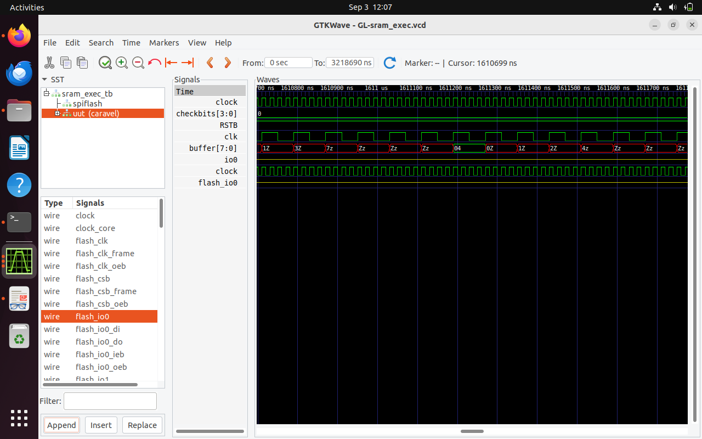
*Verifies instruction fetch requests, program counter progression, and execution timing directly out of dedicated SRAM.*

---

### 11. Caravel Housekeeping SPI
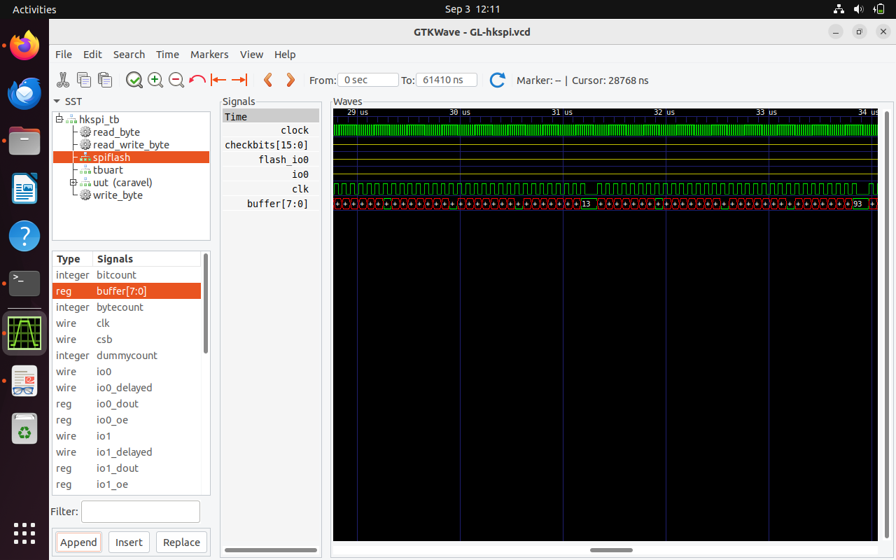
*Tracks register read and write cycles across housekeeping control registers (0 to 18) via the dedicated SPI interface.*

---

### 12. Caravel Housekeeping SPI Power
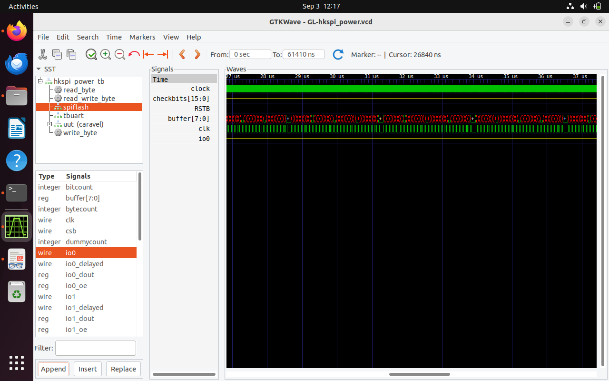
*Ensures correct logical register behavior and signal propagation across simulated power domains and supply rails.*

---

### 13. Caravel Pull-Up / Pull-Down
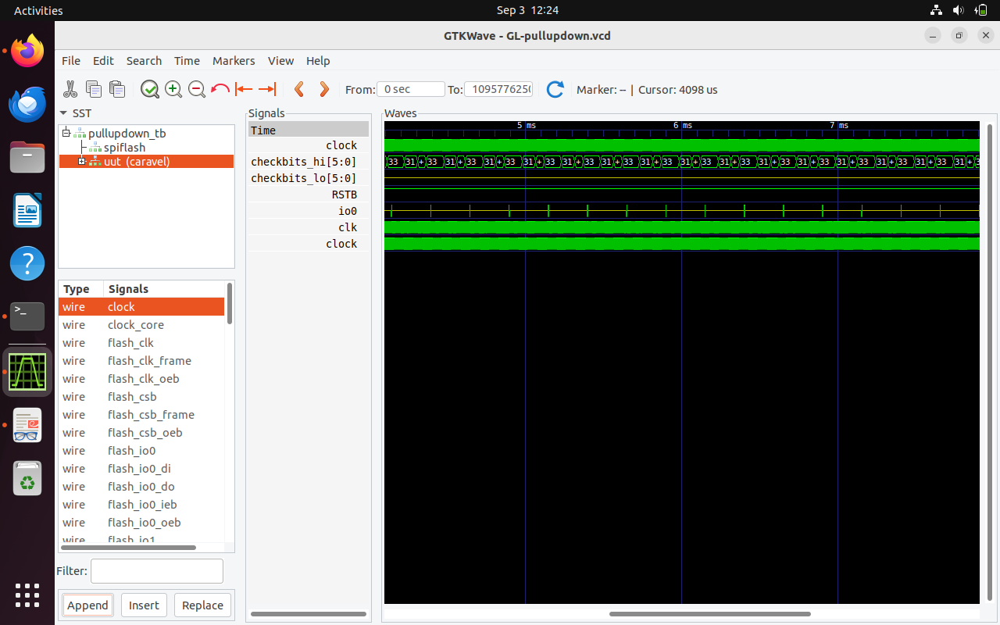
*Monitors GPIO pad weak pull-up and pull-down configurations under programmable register drive states.*

---

### 14. Caravel Pass-Thru Fix
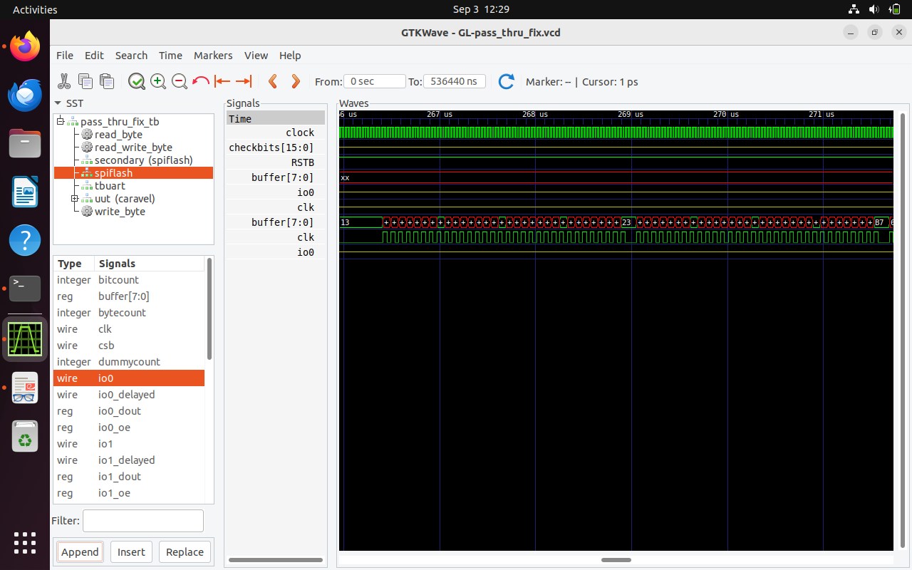
*Validates that setup and hold timing margins are satisfied on external flash lines during pass-through operations.*
