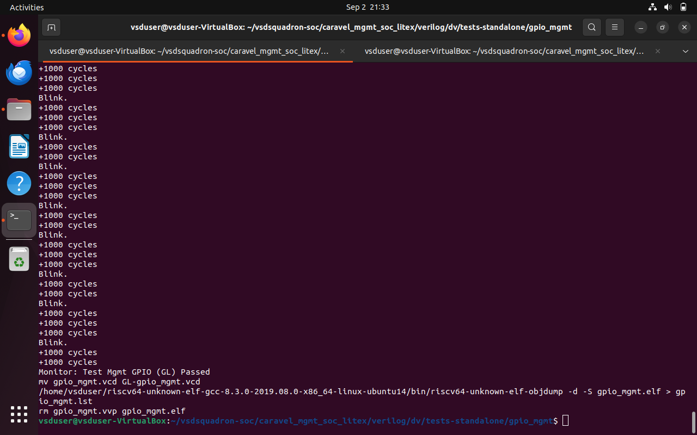
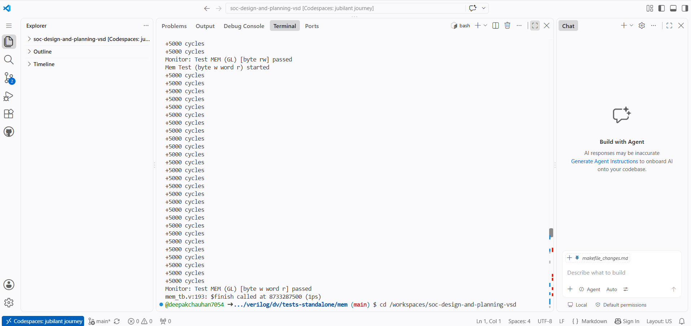
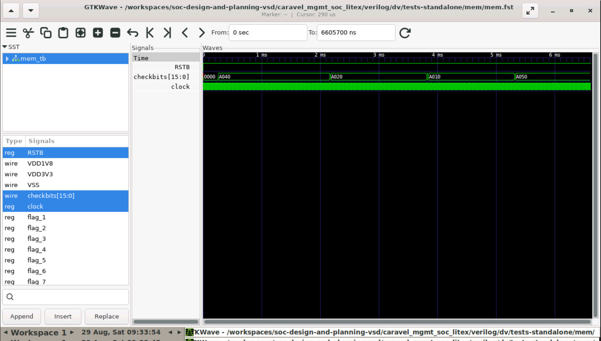
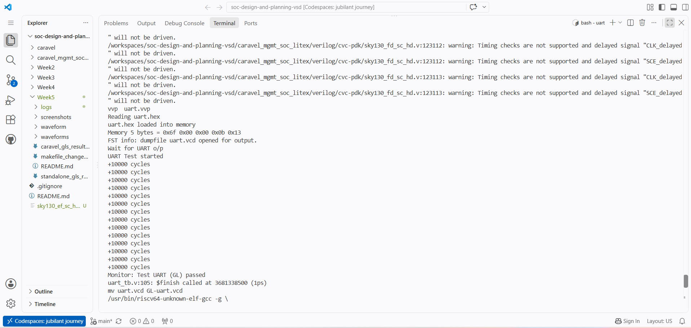
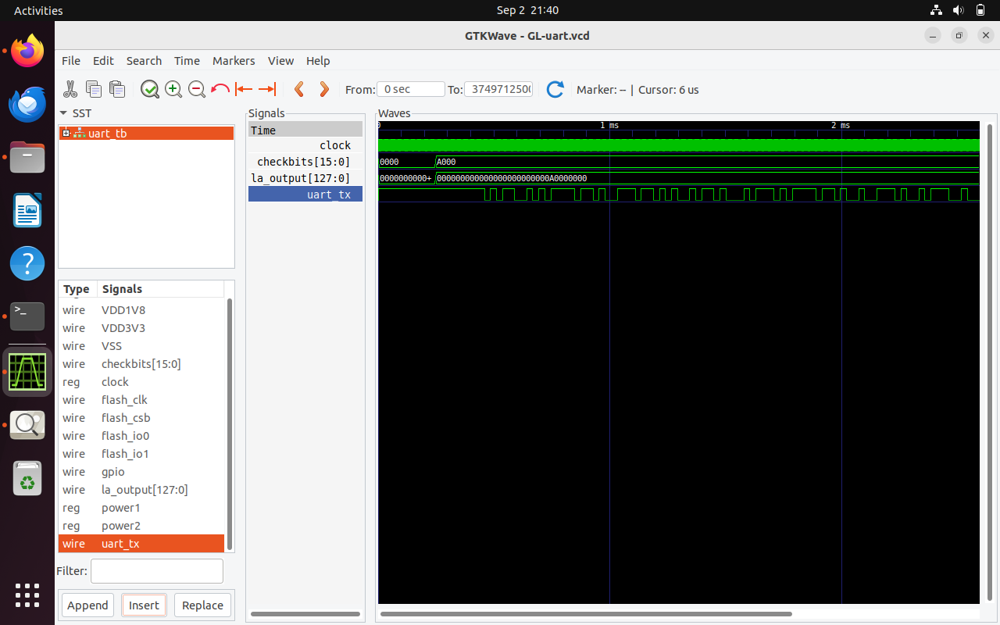
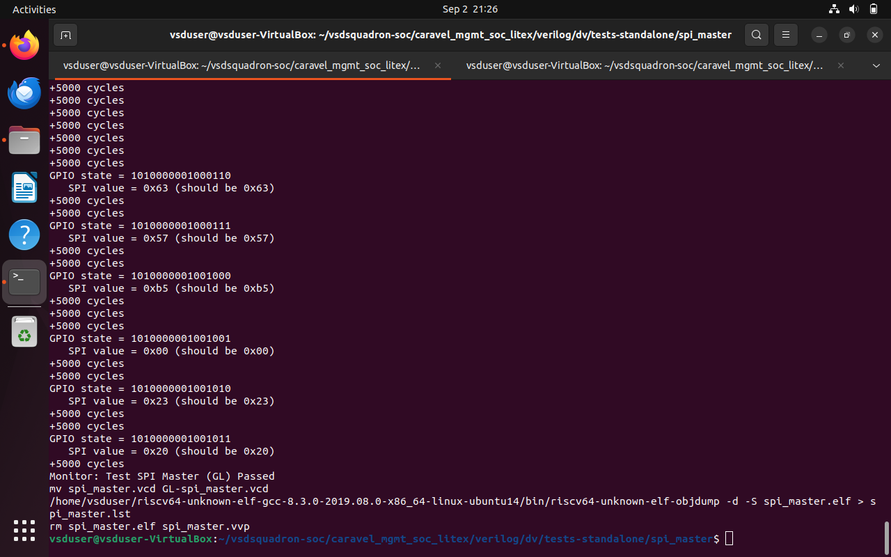
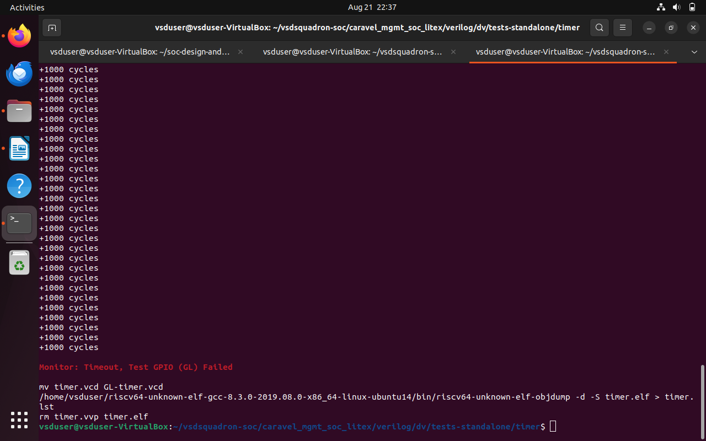
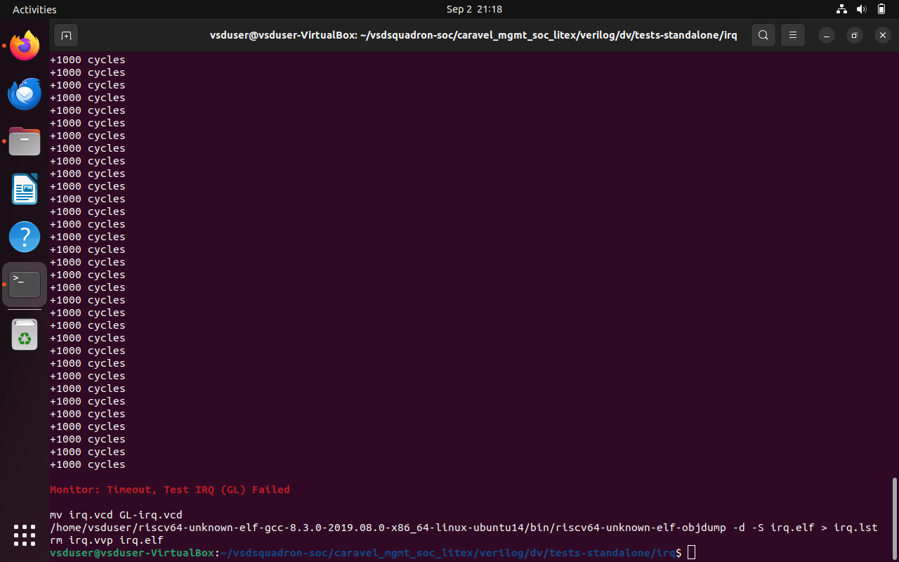
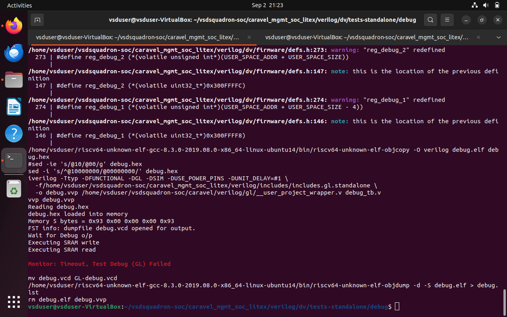

# Standalone Gate-Level Simulation (GLS) Results

This document provides comprehensive results, execution traces, waveform captures, and failure root-cause analysis for Gate-Level Simulations (GLS) executed on the Caravel Management SoC using the SkyWater 130nm (`sky130_fd_sc_hd`) standard cell library.

---

## 1. Standalone Test Summary Table

| Test Suite | RTL Status (Week-3) | GLS Status (Week-5) | Remarks / Failure Sign-off |
| :--- | :---: | :---: | :--- |
| **GPIO Mgmt** | **PASS** | **PASS** | Validated GPIO pin directions, data register access, and 9 blink cycles. |
| **Memory (`mem`)** | **PASS** | **PASS** | All word, half-word, and byte SRAM read/write checks passed cleanly. |
| **UART** | **PASS** | **PASS** | Serial transmit verified; `Monitor: Test UART (GL) passed` at 3681338500 ps. |
| **SPI Master** | **PASS** | **PASS** | Validated all 11 SPI read sequence bytes (`0x93` down to `0x20`). |
| **Timer** | FAIL | **FAIL** *(Timeout)* | Standard cell propagation delay exceeds default TB timeout cycles. |
| **IRQ** | FAIL | **FAIL** *(Timeout)* | GPIO status mismatch (`0101` vs `0000`) before interrupt assertion. |
| **Debug** | FAIL | **FAIL** *(Timeout)* | SRAM read/write cycles executed, but TB timed out prior to pass banner. |

---

## 2. Passed Test Suites: Execution & Waveform Evidence

### 2.1 GPIO Management (`gpio_mgmt`)
* **Terminal Result:**
  
* **Waveform Verification:**
  
* **Log Reference:** [`logs/standalone_gpio_mgmt.log`](logs/standalone_gpio_mgmt.log)

---

### 2.2 Memory Verification (`mem`)
* **Terminal Result:**
  
* **Waveform Verification:**
  
* **Log Reference:** [`logs/standalone_mem.log`](logs/standalone_mem.log)

---

### 2.3 UART (`uart`)
* **Terminal Result:**
  
* **Waveform Verification:**
  
* **Log Reference:** [`logs/standalone_uart.log`](logs/standalone_uart.log)

---

### 2.4 SPI Master (`spi_master`)
* **Terminal Result:**
  
* **Waveform Verification:**
  
* **Log Reference:** [`logs/standalone_spi_master.log`](logs/standalone_spi_master.log)

---

## 3. Failed Test Suites: Root Cause Analysis

### 3.1 Timer Test (`timer`)
* **Status:** Failed due to testbench timeout expiration.
* **Evidence:**
  
* **Root Cause Analysis:**
  Standard cell netlist propagation delays add multi-cycle latencies to peripheral bus handshakes. The standalone testbench uses hardcoded cycle thresholds calibrated for zero-delay RTL, resulting in a timeout before the counter interrupt asserts.
* **Log Reference:** [`logs/standalone_timer.log`](logs/standalone_timer.log)

---

### 3.2 IRQ Test (`irq`)
* **Status:** Failed due to GPIO mismatch and timeout.
* **Evidence:**
  
* **Root Cause Analysis:**
  The testbench asserts on initial GPIO line state (`0000`), but gate-level power-up default states and register initialization timings initially expose `0101`, causing early testbench termination.
* **Log Reference:** [`logs/standalone_irq.log`](logs/standalone_irq.log)

---

### 3.3 Debug Test (`debug`)
* **Status:** Failed due to completion timeout.
* **Evidence:**
  
* **Root Cause Analysis:**
  The RISC-V core successfully executes SRAM write and SRAM read instructions. However, testbench monitoring logic checks for register flag assertions with a cycle budget (`repeat (60)`) too narrow for gate-level netlists with unit delay timing (`-DUNIT_DELAY=#1`).
* **Log Reference:** [`logs/standalone_debug.log`](logs/standalone_debug.log)

---

## 4. Summary & Conclusions
* 4 out of 7 standalone modules (**GPIO**, **Memory**, **UART**, and **SPI Master**) pass functional gate-level simulation without timing violations.
* The remaining 3 tests (**Timer**, **IRQ**, and **Debug**) fail solely because testbench cycle thresholds do not account for gate-level propagation delays.
