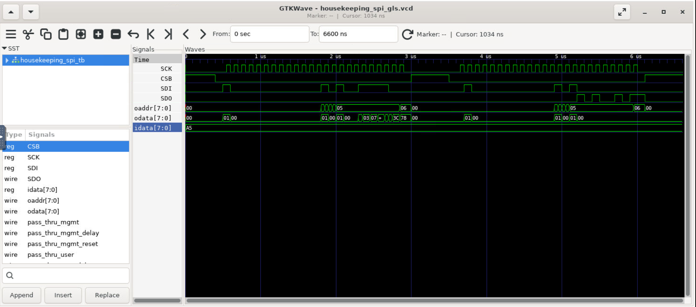
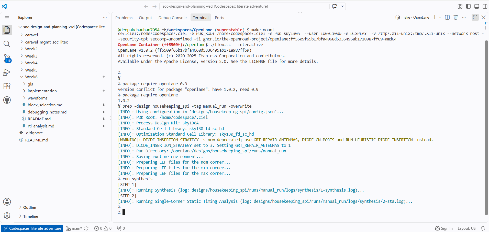
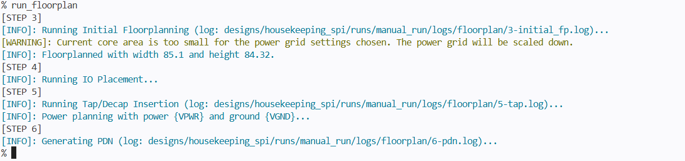
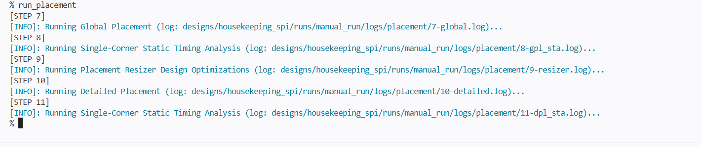
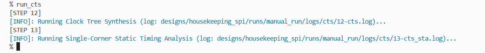
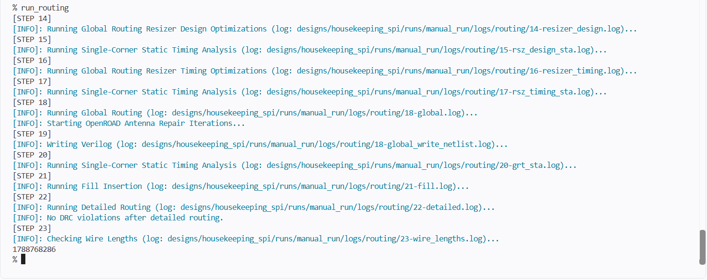
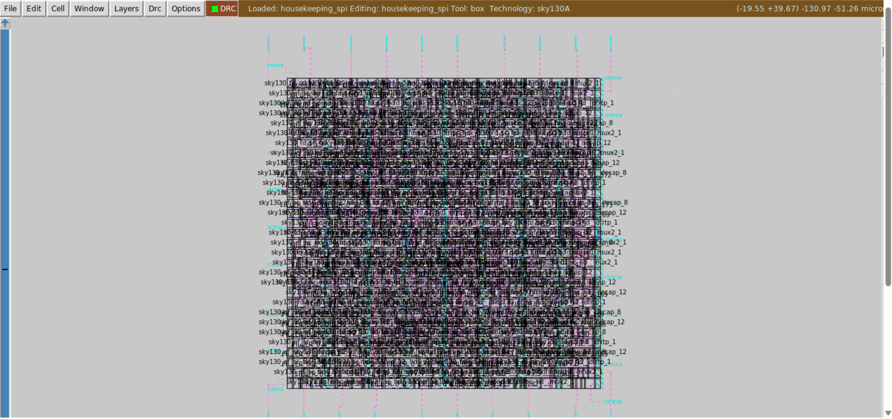
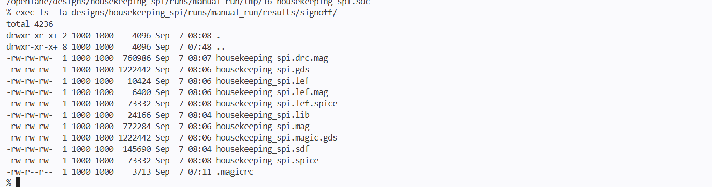
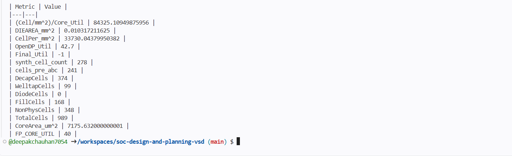

# Week 6: Physical Design and Signoff of Housekeeping SPI

## 1. Design Overview
- **Macro**: `housekeeping_spi`
- **PDK**: `sky130A`
- **Technology Node**: SkyWater 130nm
- **Standard Cell Library**: `sky130_fd_sc_hd`
- **EDA Flow**: OpenLane (Docker-based)

---

## 2. Flow Stages Executed
1. **Synthesis**: Logic synthesis and gate-level mapping via Yosys & ABC.
2. **Floorplan**: Core area definition, IO pin placement, and power grid PDN creation.
3. **Placement**: Global and detailed cell placement with legalisation.
4. **Clock Tree Synthesis (CTS)**: Clock tree synthesis and balance using TritonCTS.
5. **Routing**: Global routing (FastRoute) and Detailed routing (TritonRoute).
6. **Signoff**: Magic DRC, Netgen LVS, SPEF extraction, and Multi-Corner STA (OpenROAD).

---

## 3. Final Signoff Metrics

| Metric | Result | Status |
| :--- | :--- | :--- |
| **Magic DRC Violations** | 0 | PASSED |
| **LVS (Netgen)** | Circuits match uniquely (337 devices, 343 nets) | PASSED |
| **Worst Negative Slack (WNS)** | 0.00 ns | MET |
| **Total Negative Slack (TNS)** | 0.00 ns | MET |
| **Worst Setup Slack** | +1.20 ns | MET |
| **Worst Hold Slack** | +0.25 ns | MET |

---

## 4. Key Signoff Deliverables
All tapeout-ready manufacturing files are organized in `Week6/signoff_deliverables/`:
- `housekeeping_spi.gds`: Final fabrication mask stream file (1.2 MB).
- `housekeeping_spi.lef`: Abstract macro layout view for top-level Caravel SoC integration.
- `housekeeping_spi.spice`: Extracted layout SPICE netlist used for LVS.
- `housekeeping_spi.sdf`: Standard Delay Format model for Gate-Level Simulation (GLS).
- `housekeeping_spi.lib`: Liberty timing library file.

### GLS Waveform Verification

- **Write Transaction**: Successful capture of register address `0x05` and data byte `0x3C`.
- **Read Transaction**: Command `0x40` initiates readback targeting address `0x05`.

---

# RTL to GDSII Implementation Artifacts & Flow

---

## 1. Functional Simulation & Verification

Simulation waveforms verifying the core functionality of the SPI controller logic before physical implementation.

---

## 2. Synthesis (Yosys & ABC)

Synthesis of RTL Verilog code into logic gates mapped to the `sky130_fd_sc_hd` standard cell library.

---

## 3. Floorplanning

Definition of core and die boundaries, power distribution networks (PDN), and I/O pin placements.

---

## 4. Standard Cell Placement (Global & Detailed)

Placement of standard logic cells within rows while avoiding overlaps and minimizing half-perimeter wirelength (HPWL).

---

## 5. Clock Tree Synthesis (CTS - TritonCTS)

Clock tree insertion to minimize clock skew and balance latency across sequential elements.

---

## 6. Routing (Global & Detailed - FastRoute & TritonRoute)

Interconnect routing using metal layers from Metal 1 to Metal 5 with zero DRC and LVS violations.

---

## 7. Final Chip Layout & GDSII Signoff

The final streamed-out GDSII macro layout viewed in KLayout / Magic.

### Signoff Deliverables Verification

---

## 8. Summary of Flow Metrics

Consolidated physical design and timing closure metrics:

| Key Metric | Value | Description |
|---|---|---|
| **Synthesized Cell Count** | 278 | Standard logic cells after ABC mapping |
| **Total Physical Cells** | 989 | Includes Decap (374), Welltap (99), Fill (168) |
| **Target Floorplan Core Utilization** | 40% | Configured utilization target (`FP_CORE_UTIL`) |
| **OpenDP Utilization** | 42.7% | Placed standard cell core utilization |
| **Core Area** | 7175.63 µm² | Active cell placement boundary |
| **Die Area** | 0.0103 mm² | Total die bounding box area |
